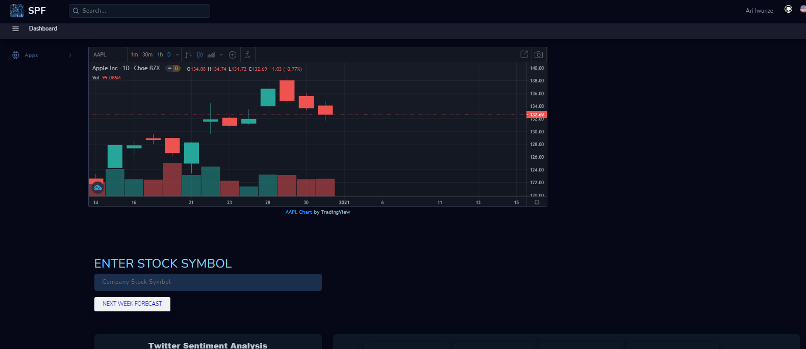
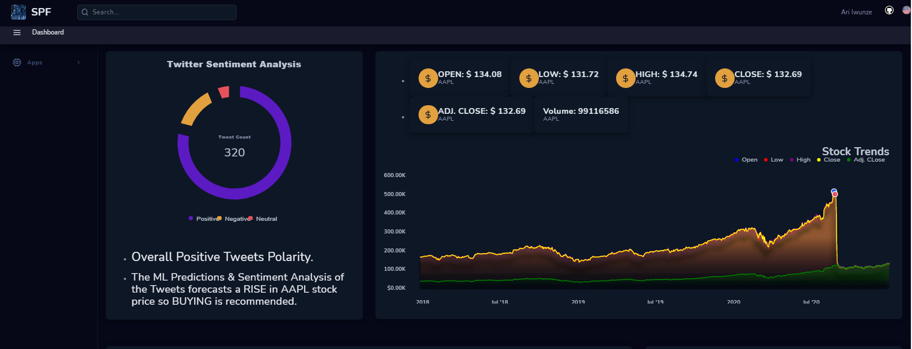
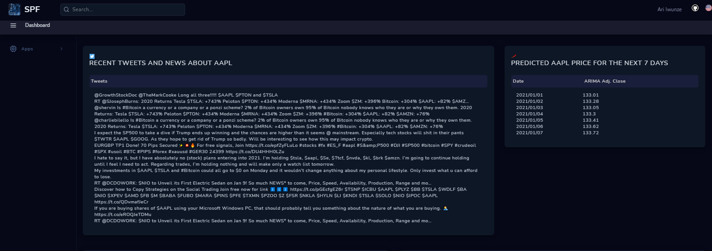
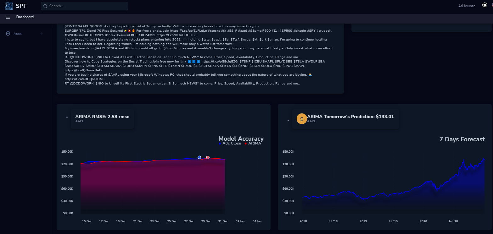
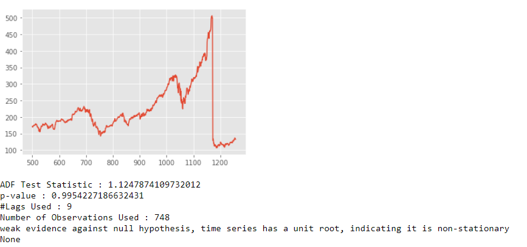
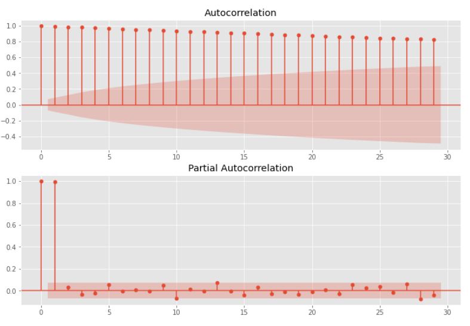
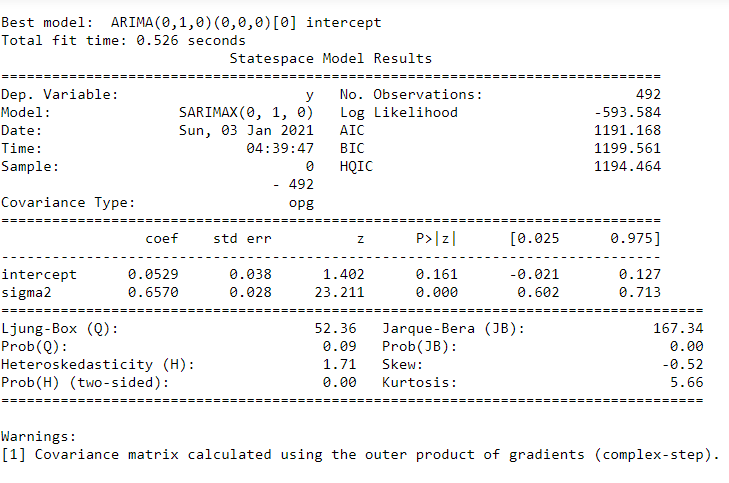
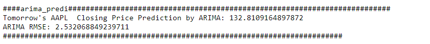
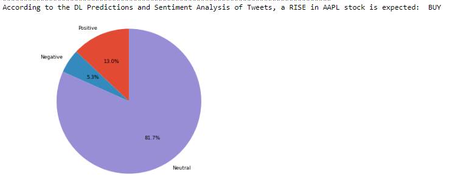

# Application Web Flask de prévision du cours des actions

### Prévision du prix de clôture ajusté d'Apple pour les 7 prochains jours

 # Table de matière
* [Objectif](#objectif)
* [Description des données](#Description-des-données)
* [Model](#model)
* [Recommendation](#recommendation)
* [Setup](#setup)
* [Configuration](#configuration)
* [Travaux futurs](#travaux-futurs)
  
 ## Preview
  
  
  
  
  
## Objectif
L'objectif de notre application est de construire un modèle capable de prédire efficacement le prix de clôture ajusté d'une entreprise pour les 7 prochains jours.

## Description des données
Pour ce travail nous avons recupérer les données de yahoo finances indiqué dans le lien suivant:
* https://finance.yahoo.com/q/hp?s=YHOO

## Model
Tout d'abord, j'ai chargé l'ensemble de données spécifique à Apple (AAPL) à partir de Yahoo Finance. Cet ensemble de données est composé de 12 fonctionnalités différentes, mais j'ai simplement utilisé la colonne Adj. Close price puisque c'est ce que je vais prévoir à l'aide du modèle ARMA. L'étape suivante consiste à tester la stationnarité, mais étant donné qu'il s'agit de données boursières, il est très probable qu'elles ne soient pas stationnaires. En effet, les cours des actions augmentent généralement avec le temps. Donc, étant donné qu'elles ne sont pas stationnaires, la moyenne des données augmente avec le temps, ce qui pourrait finalement conduire à une dégradation du modèle.
Pour tester si les données sont stationnaires, j'ai utilisé le test de Dickey-Fuller augmenté. Comme nous pouvons le voir, la valeur p est supérieure au niveau de signification de 0,05, donc j'accepterai l'hypothèse nulle selon laquelle les données ne sont pas stationnaires.
  
  
  
  
## [Results](./arima_and_nlp.ipynb)
Ensuite, j'ai créé des tracés ACF et PACF pour déterminer les paramètres d'entrée p et q pour notre modèle ARIMA. D'après les tracés, 1 et 2 semblent être de bonnes valeurs pour p et q respectivement, mais je vais quand même exécuter un modèle autoarima pour être sûr d'utiliser les paramètres les plus optimaux. J'ai ensuite ajusté le modèle dans la moitié des données en utilisant 0 comme paramètres p et q obtenus à partir de l'exécution du modèle autoarima avec 1 comme ordre de différenciation. Après avoir validé le modèle avec les résultats des tests, mon erreur quadratique moyenne est de 2,5 rmse, ce qui n'est pas trop mal. 
    
  
    
  

### Recommendation
* 0 semble être les meilleurs paramètres pour p et q avec 1 comme ordre de différenciation à utiliser lors de la prévision de l'ensemble de données sur les stocks AAPL, mais je recommande d'utiliser un modèle autoarima pour être sûr que les meilleurs paramètres sont sélectionnés avant d'intégrer les données de formation.
## Setup
- Installez les exigences et configurez l'environnement de développement.
	`pip3 install -r requirements.txt`
	`make install && make dev`

- Exécuter l'application.

		`python3 main.py`

- Naviger dans l'url `localhost:5000`.

## Travaux futurs
   * Utilisez un modèle LSTM simple pour prévoir sur 7 jours, puis faire de même avec un modèle LSTM multivarié et le modèle GRu.
